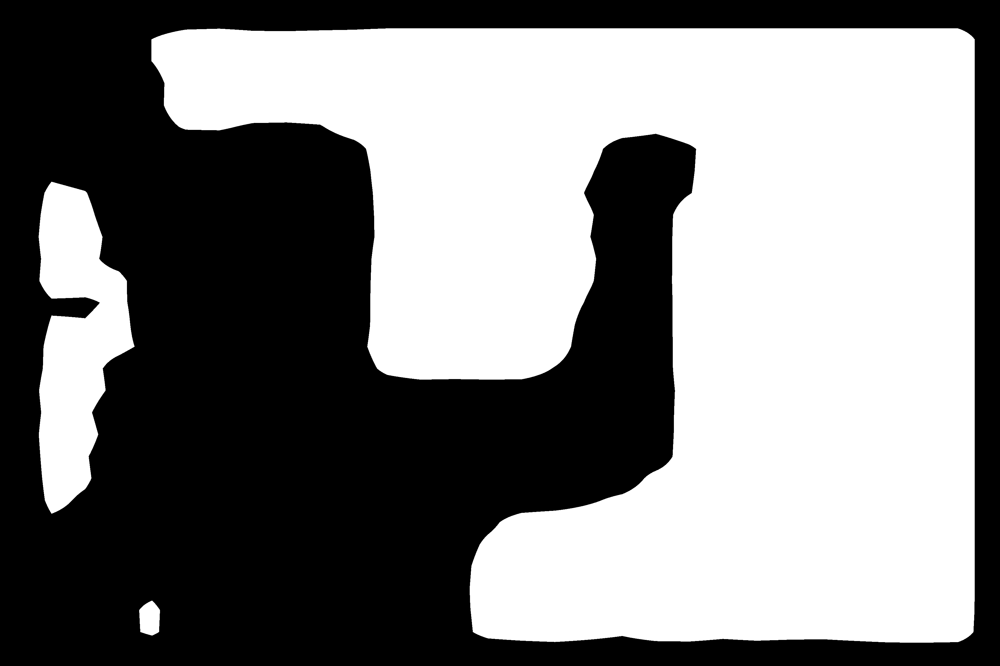

# Whiteboards-with-MaskRCNN

### *Problem statement:*

Detection and segmentation of whiteboards present in an image using [Mask-RCNN](https://arxiv.org/abs/1703.06870)

### *Use case:*

Whiteboard detection is a long standing problem that has application in domains like digitalization of education and video conferencing.

### *Challenges:*

The challenges in the problem arise from:
- Effects of lighting 
- Occlusions in the front of whiteboard
- Writings on the whiteboard

Traditional computer vision has relied on line/polygon detection and fiducial markers for detection of whiteboards.
It is hard to isolate whiteboards in images with multiple rectangular objects some of which, like doors, are often white in color.

### *Solution:*

This work is an attempt to use Mask R-CNN for detection of whiteboard and evaluate how well it does under different conditions of light and occlusion.
The code from [tensorflow implementation of Mask-RCNN by Matterport](https://github.com/matterport/Mask_RCNN)
has been used to train a dataset of whiteboard images

Steps:
1. Create dataset of whiteboard images.
2. Generate annotations for the dataset and divide into training , validation and test datasets. 
3. Transfer learning is used to train the network on the training and validation datasets , starting from pretrained COCO weights.
4. Generate masks and results on the test dataset.

### *Results:*

  
  
  
  